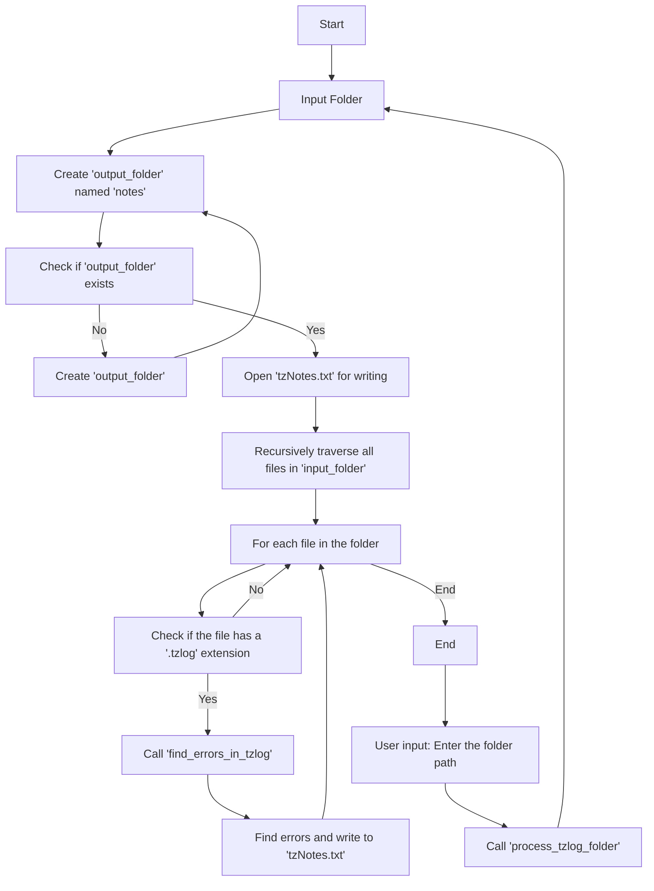

# use flowChart:

```mermaid
graph TD

A[Start] --> B[Input Folder]
B --> C[Create 'output_folder' named 'notes']
C --> D[Check if 'output_folder' exists]
D --> |No| E[Create 'output_folder']
D --> |Yes| F[Open 'tzNotes.txt' for writing]
F --> G[Recursively traverse all files in 'input_folder']
G --> H[For each file in the folder]
H --> I[Check if the file has a '.tzlog' extension]
I --> |Yes| J[Call 'find_errors_in_tzlog']
I --> |No| H
J --> K[Find errors and write to 'tzNotes.txt']
K --> H
E --> C
H --> |End| L[End]
L --> M[User input: Enter the folder path]
M --> N[Call 'process_tzlog_folder']
N --> B
```

## [about mermaid graphs](https://mermaid.js.org/intro/)

[basic graph information](https://mermaid.js.org/syntax/examples.html#basic-flowchart "mermaid graph information")
